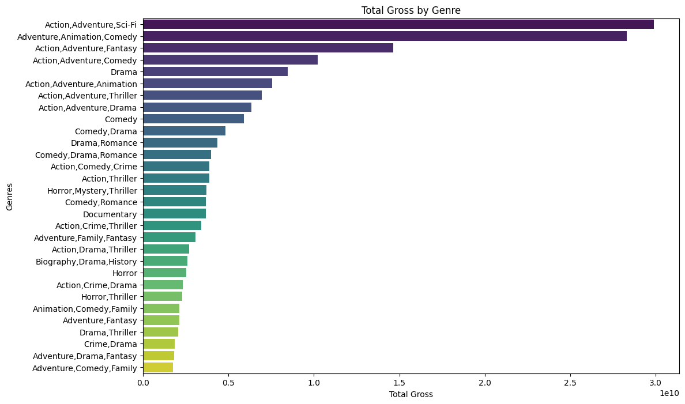
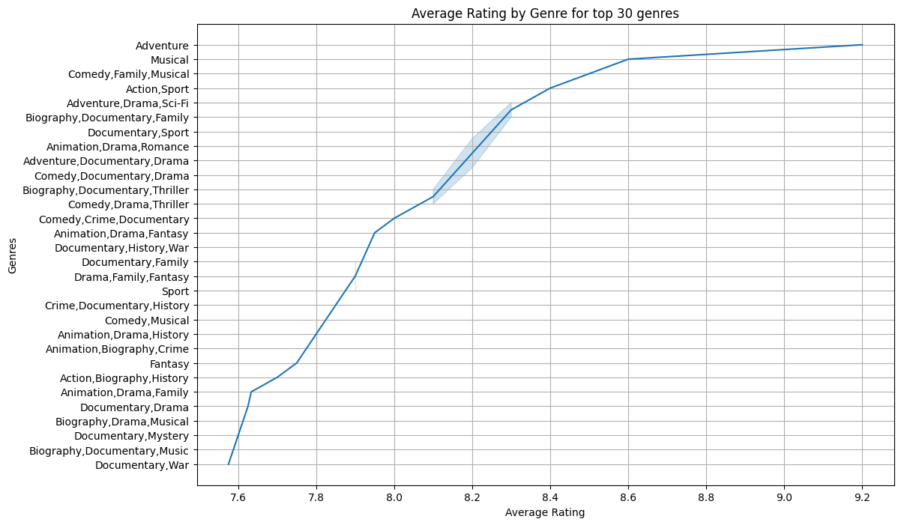
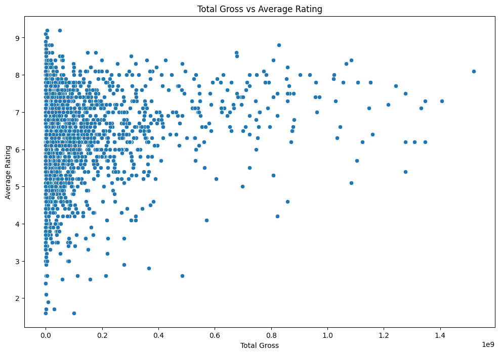

# Movie Industry Analysis

## Overview
This project aims to explore the movie industry and provide actionable insights for a new movie studio. By analyzing data from IMDb and Box Office Mojo, the goal is to identify the most successful movie genres, optimal budget allocations, and best release times for movies. The insights derived from this analysis will help the company make informed decisions about movie production and maximize their chances of success in the competitive movie industry.

## Business Understanding
### Stakeholders
**1. Head of the New Movie Studio:** Primary decision-maker responsible for overseeing the studio's strategy, production slate, and budget allocations.

**2.Data Analysts and Researchers:** tasked with providing insights and analysis to inform strategic decisions regarding genre selection, budget allocation, and release timing.

**3.Investors and Financial Backers:**those who provide the capital necessary for producing movies and expect a return on their investment.

**4.Chief Executive Office(CEO):** Provides overall vision and direction for the company's new venture into movie production. 

## Key Business Questions
1. What types of films are currently performing the best at the box office?
   - Identify the genres performing really well that could be invested in.
2. How do IMDb ratings/number of votes correlate with box office revenue?
   - Determing if high ratings really affect the revenue of a movie
3. When is the best time to release a movie to maximize box office success?
   - Identify the best season to release a movie.

## Data Understanding and Analysis
### Source of Data
The data for this analysis was sourced from IMDb and Box Office Mojo. These platforms provide comprehensive information about movies, including their ratings, genres, runtime, and box office performance.

## Data Description
   - movie_id: Unique identifier for each movie.
   - primary_title: The main title of the movie.
   - original_title: The original title of the movie.
   - start_year: The year the movie was released.
   - runtime_minutes: The runtime of the movie in minutes.
   - genres: The genres associated with the movie.
   - averagerating: The average IMDb rating of the movie.
   - numvotes: The number of votes the movie has received on IMDb.
   - title: The title of the movie as per Box Office Mojo.
   - studio: The studio that produced the movie.
   - domestic_gross: The domestic box office gross revenue.
   - foreign_gross: The foreign box office gross revenue.
   - year: The release year of the movie.
   - total_gross: The total box office gross revenue (domestic + foreign).

## Visualizations
**1. Total Box office revenue by Genre**
- This bar chart shows the total box office revenue for each genre, highlighting the most profitable genres.

**2. Average Rating by Genre for the top 30 Genres**
- This line plot displays the distribution of average IMDb ratings for each genre, providing insights into audience satisfaction across different genres.

**3. Revenue vs Ratings by Genre**
- This scatter plot visualizes the relationship between IMDb ratings and total box office revenue, helping to identify if higher-rated movies tend to generate more revenue.

## Conclusions
### Summary of Conclusions
<<<<<<< HEAD
**1. High Revenue-Generating Genres:** Genres such as Adventure, Sci-Fi, and Fantasy consistently generate high box office revenues and have high audience ratings. These genres should be prioritized for production to maximize profitability.
**2. Optimal Budget Allocation:** The relationship between production budgets, box office revenues, and IMDb ratings suggests that higher budgets should be allocated to genres with proven success, while niche genres can be explored with lower budgets.
**3. Strategic Release Timing:** Analysis of box office trends over time indicates that summer (June to August) and holiday seasons (November to December) are the best times to release major films, as these periods see higher audience turnout and revenue.

- By leveraging these insights, the company can make data-driven decisions about movie production, optimizing their chances of success in the movie industry.

=======
1. **High Revenue-Generating Genres:** Genres such as Adventure, Sci-Fi, and Fantasy consistently generate high box office revenues and have high audience ratings. These genres should be prioritized for production to maximize profitability.
2. **Optimal Budget Allocation:** The relationship between production budgets, box office revenues, and IMDb ratings suggests that higher budgets should be allocated to genres with proven success, while niche genres can be explored with lower budgets.
3. **Strategic Release Timing:** Analysis of box office trends over time indicates that summer (June to August) and holiday seasons (November to December) are the best times to release major films, as these periods see higher audience turnout and revenue.

- By leveraging these insights, the company can make data-driven decisions about movie production, optimizing their chances of success in the movie industry.

>>>>>>> ce84dfa1eb66dec34bc03026bc2e2bc3b52dadac
